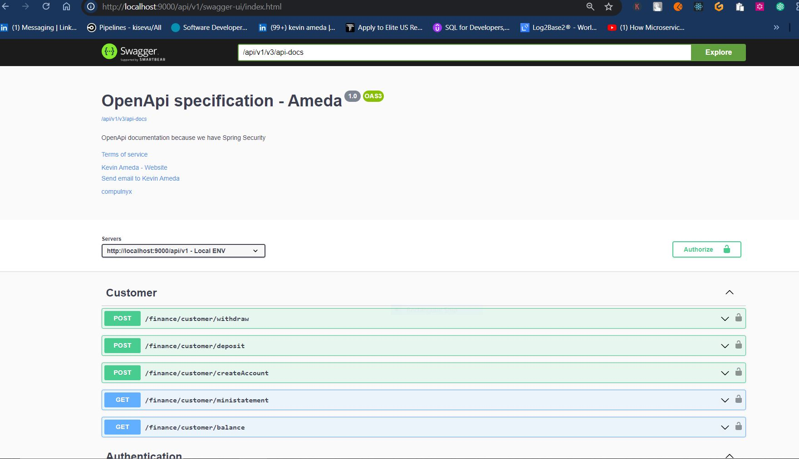

## COMPULNYX JAVA FULL-STACK DEVELOPER
*****************************************
### solutions work through
***************************************
Welcome to my solution on in regard to the full stack excercise.
So first things first, my solution requires usage of java 17 or
higher because of the JDK specifics and some minor changes 
that were added onto the java language like the usage of the 
var keyword as a variable type.
I make use of spring boot 3 and a little upgrade on deprecated 
depencies for the spring security, so for this special case I am using spring boot 
version 3.2.5 but versions 3>= works.
Either use maven as a wrapper or whether you have maven 
installed locally also works.
I have made use of the Mail dev which is powered on docker 
for testing our mails and ensuring the token is sent to it and we can click on the 
link provided there to activate our customer's account.

Mail Dev runs is powered on port 1080, which the external
port accessible via localhost.

You can either use postman or basically use the swagger for testing as well.
With the swagger is a more organized and visual appealing tool that is organized 
and can be used for the open specifications and update of our ui in angular.

accessing the swagger you can run your application through the 
mvn spring-boot:run command in the root folder / click the run button in the 
main class.

### steps to getting the solution up and running
**************************************************

* use docker-compose up -d command to start mail dev. 
* use mvn spring-boot:run to start this spring boot project.
* Navigate to the browser and hit http://localhost:9000/swagger-ui.html to access the application.
* Test endpoints by performing registration, activation of an account to set the activate flag, and then you can proceed with the login
* The above-mentioned resources are bypassed, and they do not require authentication, but the rest are under tight security.
* My frontend is powered on port 4200 with the APIs tightly tied to them.
